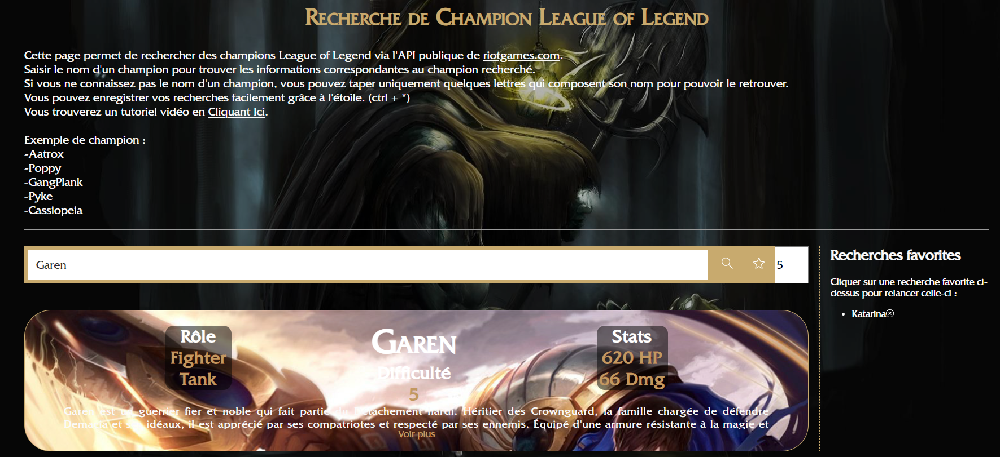
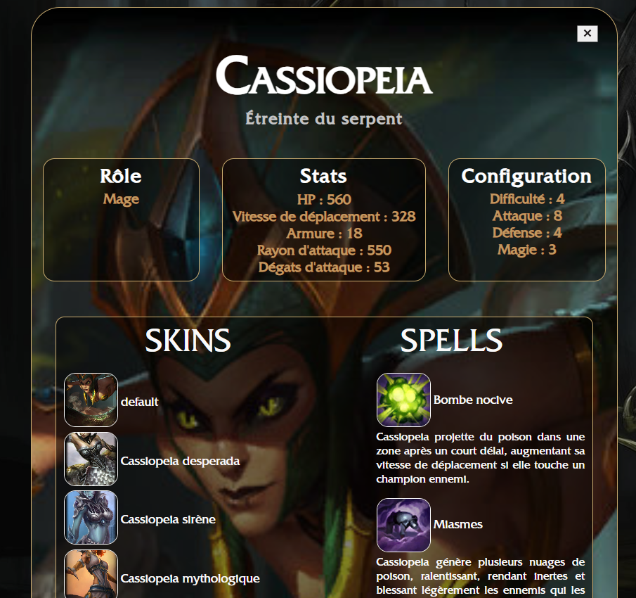

# Projet API IUT2

Projet réalisé par Jordan Josserand, Marco Vassal et Lucas Guichard

Lien du projet : [Site API IUT2](https://jojo-jrd.github.io/iut2-javascript-api/)

## Présentation

L'objectif de ce projet était l'utilisation d'une API public externe avec une barre de recherche et surtout un gestion des favoris grâce au `LocalStorage`. Ce projet est réalisé en HTML 5, CSS 3 et JavaScript/JQuery. Nous avons décidé d'utiliser l'API du célèbre jeu League of Legend de [RiotGames](https://www.riotgames.com/fr). Nous utilisons uniquemet une partie de l'API qui a pour but d'avoir les données et informations de chaque champion (personnages jouables dans le jeu) à partir d'une recherche.

## Résultat final

### Recherche d'un personnage

### Informations d'un personnage

